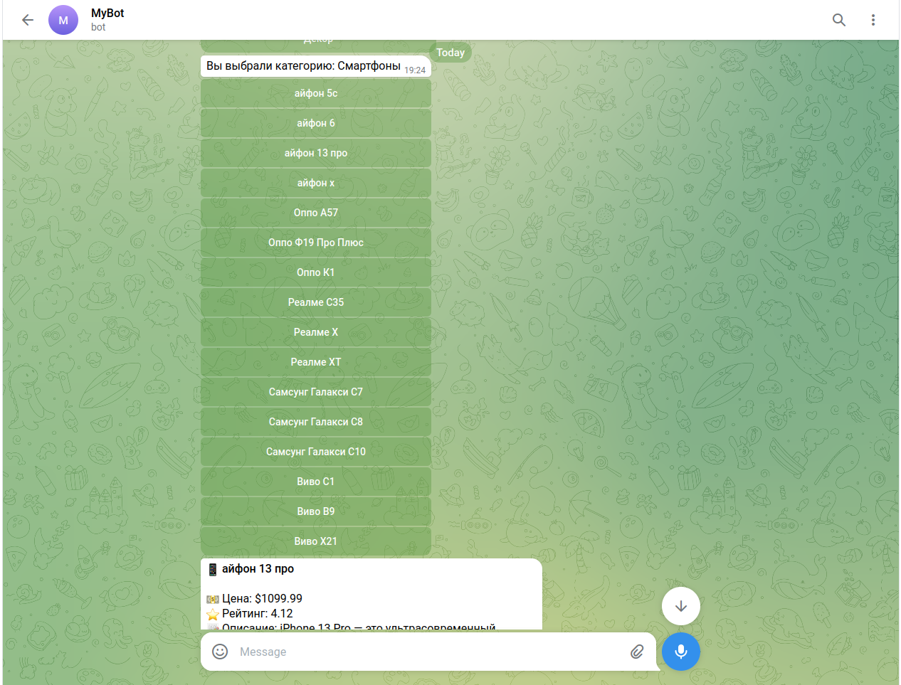
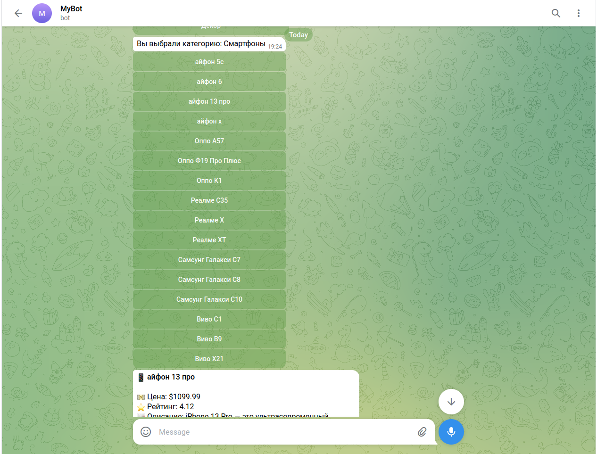
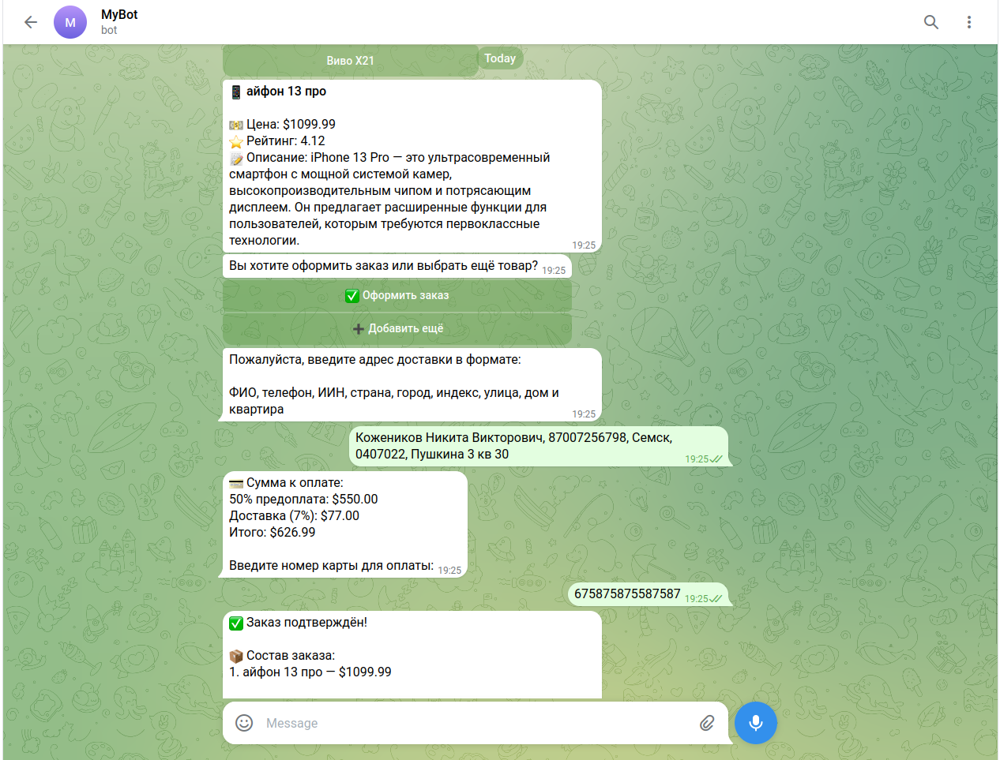
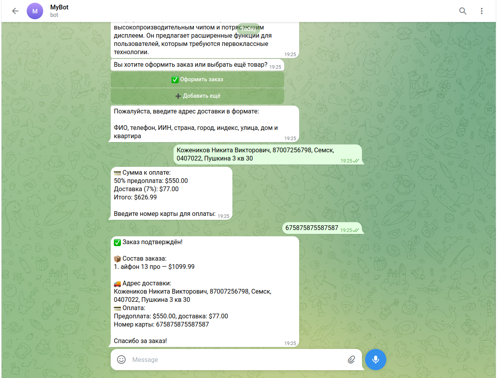

# Telegram Bot API Integration

Бэкенд-часть Telegram-бота, разработанная в рамках обучения на платформе Skillbox. 

### Основные функции:
* Интеграция со сторонним API для сбора данных.
* Автоматизация обработки запросов пользователей.
* Хранение истории запросов в базе данных SQLite через ORM Peewee.

### Технологии:
* **Язык:** Python 3.x
* **Библиотеки:** Requests, Peewee
* **База данных:** SQLite
=======
Бэкенд-часть Telegram-бота, разработанная в рамках обучения на платформе Skillbox.

## 🚀 Основные возможности

- Выбор языка интерфейса (русский / английский)
- Просмотр категорий и товаров
- Получение информации о товаре (цена, рейтинг, описание)
- Оформление заказа с вводом данных пользователя
- Поиск товаров по ключевым словам (`/find`)
- Просмотр топ товаров по категории (`/top`)
- Сохранение истории запросов (`/history`)

## 🧠 Работа с данными

- Интеграция с внешним API: https://dummyjson.com
- Хранение истории запросов в базе данных SQLite
- Использование ORM Peewee для работы с БД

## 🛠️ Технологии

- Python 3.x
- python-telegram-bot
- Requests
- Peewee
- SQLite

## 📂 Структура проекта
telegram_bot/
├── handlers/ # обработчики команд и логики бота
├── keyboards/ # inline-клавиатуры
├── models/ # модели данных
├── utils/ # вспомогательные модули (история, перевод)
├── history.db # база данных SQLite
├── main.py # точка входа


## ▶️ Запуск проекта
1. Установить зависимости:
pip install -r requirements.txt

2. Создать файл `config.py` и добавить токен бота:
```python
BOT_TOKEN = "your_token_here"
```

3.Запустить бота:
python main.py

📌 Примечание
История запросов сохраняется в базе данных history.db и доступна через команду /history.


📸 Примеры работы
## 📸 Примеры работы бота

### Выбор языка


### Выбор категории


### Карточка товара


### Оформление заказа


